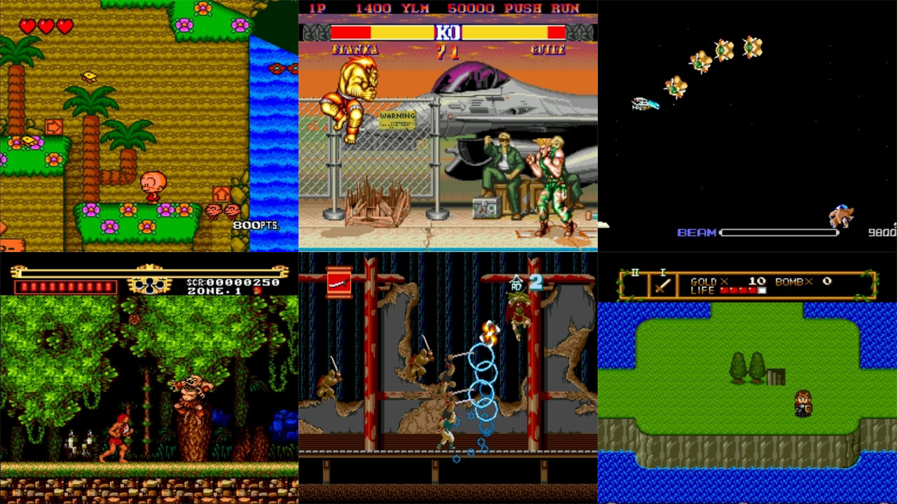
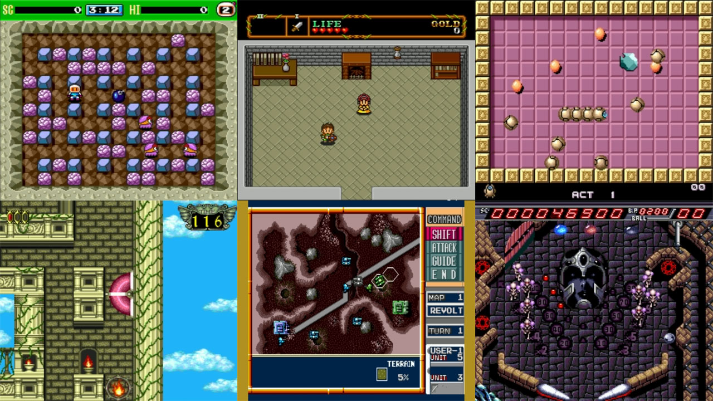
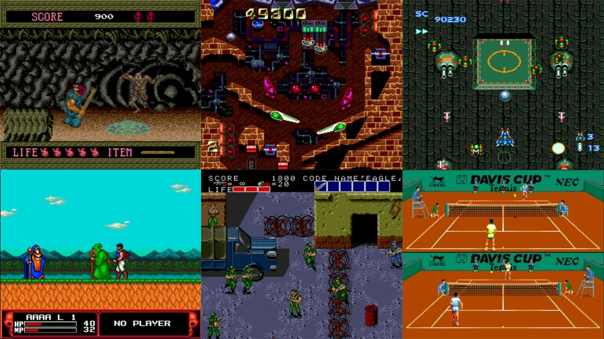

# NEC - PC Engine / SuperGrafx / CD (Beetle PCE)

### Description

Beetle PC Engine is a fork of Mednafen's PC Engine driver.

This PC Engine module is more accurate than the Beetle PC Engine Fast module, at the expense of speed.

### License

GPLv2

### Icon

### Fanart

Help make me fanart!

### Screenshots

